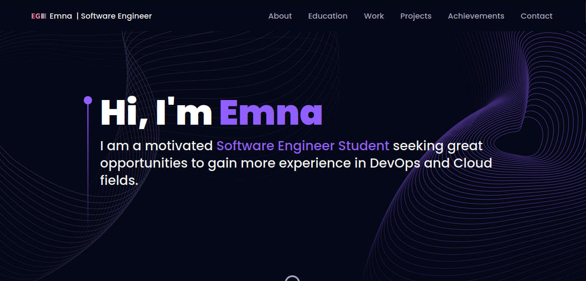
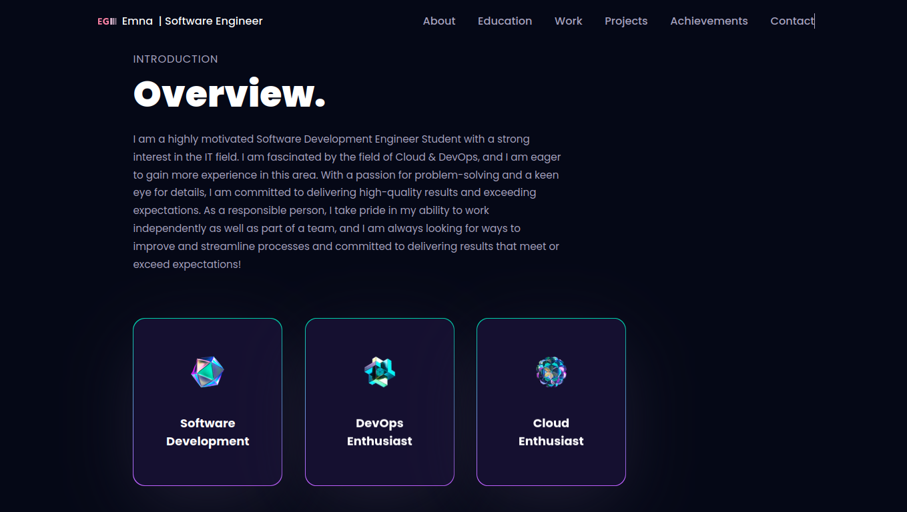
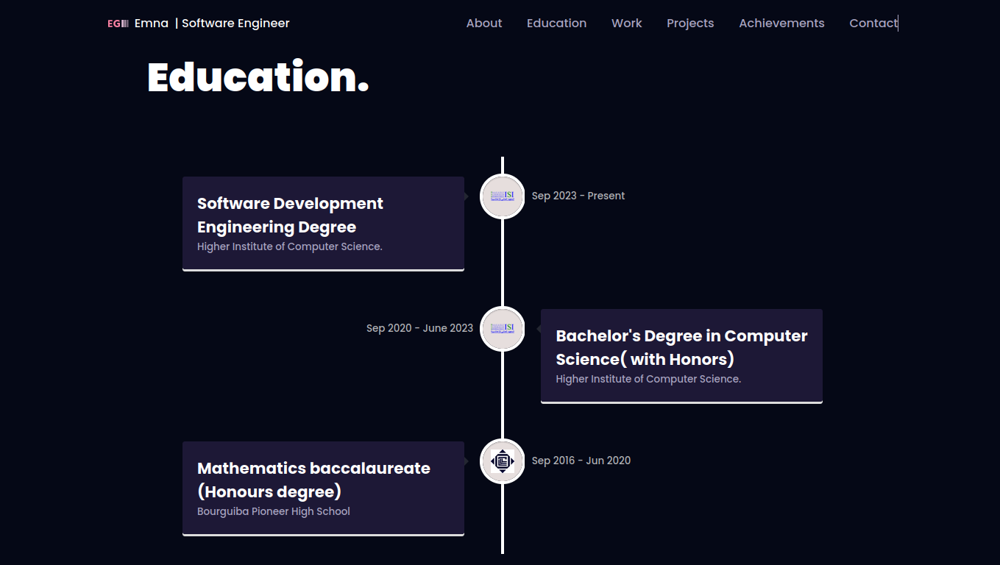
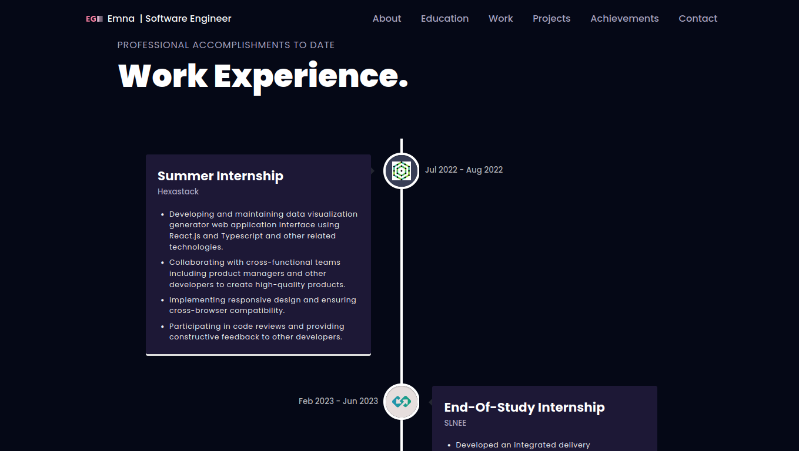
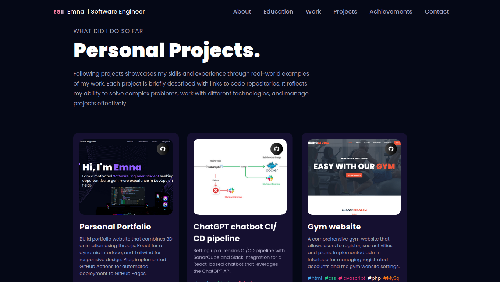
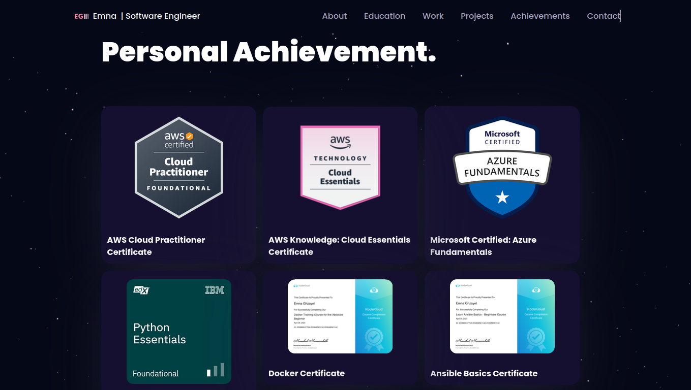
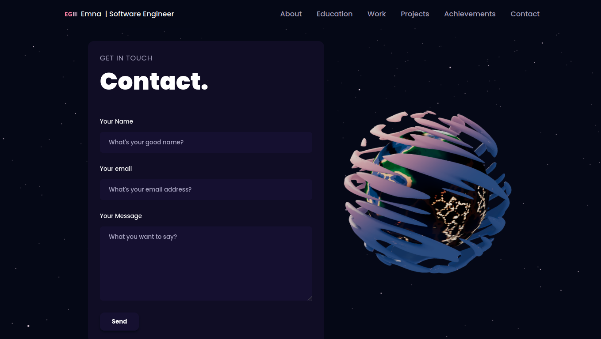

# Portfolio Website Project

## Overview

Welcome to my Portfolio Website project! This web application is a reflection of my work experience and other noteworthy details, offering a comprehensive view of my skills and achievements.
<a href="https://emnaghz.github.io/personal-portfolio/">View Demo</a>

### Description

This portfolio website project is crafted to provide an engaging overview of my professional journey, incorporating various impressive details for an informative and visually appealing user experience.

## Screenshots

### Welcome Page

### Academic History

### Professional Accomplishments

### Personal Projects

### Personal Achievement

### Contact Page

## Tools

In building this project, I harnessed the power of the following tools and technologies:

- **ThreeJS**: A robust 3D graphics library for rendering and animating the 3D model on the website.

- **React Three Fiber**: A popular React library seamlessly integrating with ThreeJS, simplifying the creation of stunning 3D graphics within a React application.

- **TailwindCSS**: A utility-first CSS styling framework for crafting a responsive and visually appealing design.

- **Framer Motion**: The go-to library for adding captivating animations to a React website, enhancing the overall user experience.

- **EmailJS**: Implemented email functionality through a form on the website using the EmailJS service, ensuring a convenient and reliable communication channel.

- **GitHub Actions**: Established a robust pipeline for building and deploying the website, automating the process and keeping the website up-to-date on GitHub Pages.

## :gem: Acknowledgements

This section used to mention useful resources and libraries that used in 3D Portfolio

 - [Email JS](https://www.emailjs.com/)
 - [Framer Motion](https://www.framer.com/motion/)
 - [React Tilt](https://www.npmjs.com/package/react-tilt)
 - [React Vertical Timeline Component](https://www.npmjs.com/package/react-vertical-timeline-component)
 - [JSMastery](https://github.com/adrianhajdin)

Feel free to explore the codebase, and don't hesitate to reach out if you have any questions or feedback. Thank you for checking out my Portfolio Website project!

Emna Ghzayel
